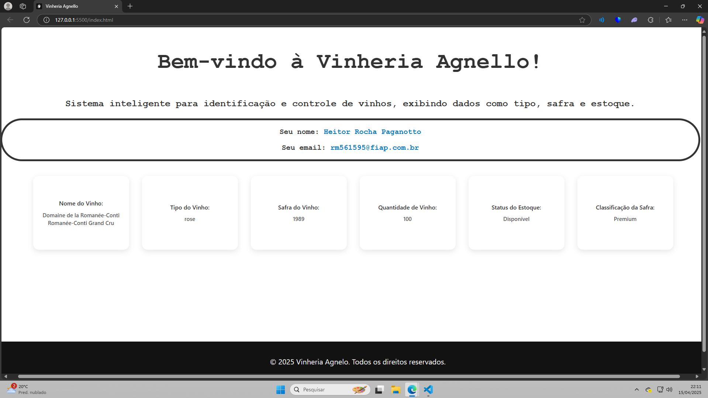

# 🍷 Projeto: **Wasco Solutions**

Sistema básico para **cadastro e análise de vinhos** da vinícola **Vinheria Agnello**.

---

## 📌 Descrição

Este projeto tem como objetivo desenvolver uma ferramenta simples, porém funcional, para **registrar e analisar vinhos** artesanais. O sistema é totalmente baseado em **JavaScript puro**, utilizando recursos como `prompt()`, `alert()` e `console.log()`.

As funcionalidades incluem:
- Cadastro de vinhos com informações obrigatórias
- Validação de dados inseridos
- Análise da safra do vinho
- Verificação de estoque
- Exibição das informações no console

---

## 👥 Integrantes

- **Caio Alexandre Ziviani Poci **RM: 562256****
- **Heitor Rocha Paganotto **RM: 561595****
- **Thiago Alessandro Gois Ferreira **RM: 562446****

---

## 🌐 GitHub Pages

🔗 [Acessar página do projeto](https://heitorpaganotto.github.io/vinheria-agnello/)

---

## 📷 Demonstração 

